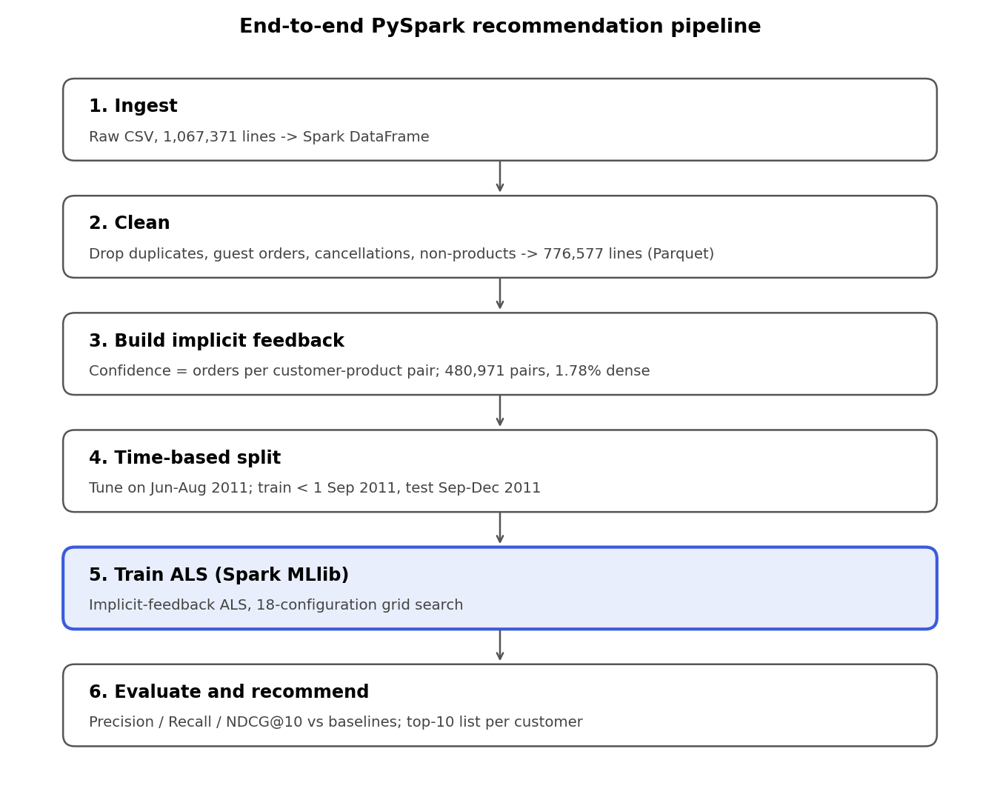
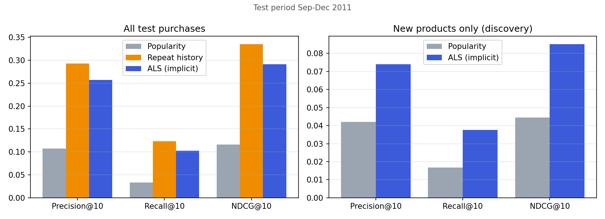

# E-commerce Product Recommendation with PySpark ALS

Big Data Analytics, Assignment 10, BE Computer Engineering (Sem 7), Vidyalankar Institute of Technology.

**Authors:** Vismaya Katkar (23102B0069) and Unnati Buddhiwant (24102B2002). See [CONTRIBUTIONS.md](CONTRIBUTIONS.md).

**Blog post:** https://medium.com/@katkarvismaya19/beyond-bestsellers-building-a-scalable-e-commerce-recommender-with-pyspark-als-95781ddca519)

An end-to-end recommender built on a real e-commerce transaction log (UCI Online Retail II, 1.07M lines). It covers Spark cleaning, an implicit-feedback signal, distributed ALS with a time-based train/test split, and an honest comparison against two baselines.



## Results (test period: 1 Sep to 9 Dec 2011, 2,339 customers)

| Task | Model | Precision@10 | Recall@10 | NDCG@10 | Hit rate@10 | Coverage |
| --- | --- | --- | --- | --- | --- | --- |
| All purchases | Popularity | 0.107 | 0.033 | 0.117 | 57.1% | 0.2% |
| All purchases | Repeat history | **0.293** | **0.124** | **0.335** | **78.5%** | **56.9%** |
| All purchases | ALS (implicit) | 0.257 | 0.103 | 0.291 | 75.9% | 19.6% |
| Discovery (new items) | Popularity | 0.042 | 0.017 | 0.045 | 29.8% | 1.7% |
| Discovery (new items) | ALS (implicit) | **0.074** | **0.038** | **0.085** | **42.7%** | **23.3%** |

Best ALS setting: `rank=50, regParam=0.1, alpha=1.0` (full grid in `results/tuning.csv`).



## Dataset

UCI Online Retail II: https://archive.ics.uci.edu/dataset/502/online+retail+ii (CC BY 4.0).

The raw data is not committed. `scripts/download_data.py` fetches it, or see [data/README.md](data/README.md).

## Repository layout

```
├── run_all.sh                  # runs the whole pipeline end to end
├── requirements.txt
├── CONTRIBUTIONS.md
├── data/README.md              # how to get the dataset
├── scripts/
│   ├── download_data.py        # UCI download -> data/online_retail_II.csv
│   ├── plot_results.py         # model comparison chart from metrics.json
│   └── architecture_png.py     # architecture figure for the blog
├── src/
│   ├── spark_session.py        # SparkSession factory (local[*]; change master for a cluster)
│   ├── preprocess.py           # Step 1: clean + build implicit interactions (Parquet)
│   ├── eda.py                  # Step 2: exploratory analysis + figures
│   ├── metrics.py              # Precision/Recall/NDCG/Hit rate@K, coverage
│   ├── train_als.py            # Step 3: tuning, final ALS, baselines, evaluation
│   └── recommend.py            # Step 4: top-N recommendations for a customer
└── results/
    ├── cleaning_report.json, eda.json, metrics.json, tuning.csv
    ├── sample_recommendation_12347.txt
    └── figures/*.png
```

## How to run

Requirements: Python 3.9+ and Java 8/11/17 (needed by Spark).

```bash
pip install -r requirements.txt
./run_all.sh                    # about 10-15 min on a laptop, most of it the 18-config grid search
```

Or run the steps individually from the repo root:

```bash
python scripts/download_data.py
python src/preprocess.py
python src/eda.py
python src/train_als.py
python src/recommend.py 12347            # any CustomerID; add --include-seen to allow repeat items
```

## Method in brief

1. **Cleaning:** drop duplicates, guest orders (no Customer ID), cancellations, non-positive quantity or price, and non-product codes. This leaves 776,577 of 1,067,371 lines.
2. **Signal:** confidence = number of separate orders per customer-product pair (480,971 pairs, 1.78% matrix density).
3. **Split by time:** tune on train < 2011-06-01 / validate Jun-Aug 2011; final train < 2011-09-01 / test Sep-Dec 2011.
4. **Model:** Spark MLlib ALS with `implicitPrefs=True`, grid over rank {10,20,50}, regParam {0.01,0.1}, alpha {1,5,20}.
5. **Evaluation:** Precision, Recall, NDCG and Hit rate @10 plus catalogue coverage. Scored on all test purchases and on new-to-customer products only (discovery). Compared against popularity and repeat-history baselines.

## References

- Hu, Koren, Volinsky. *Collaborative Filtering for Implicit Feedback Datasets.* IEEE ICDM 2008.
- Koren, Bell, Volinsky. *Matrix Factorization Techniques for Recommender Systems.* IEEE Computer, 2009.
- Apache Spark MLlib, Collaborative Filtering: https://spark.apache.org/docs/latest/ml-collaborative-filtering.html
